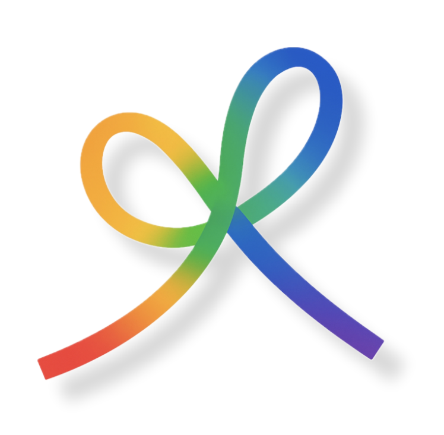
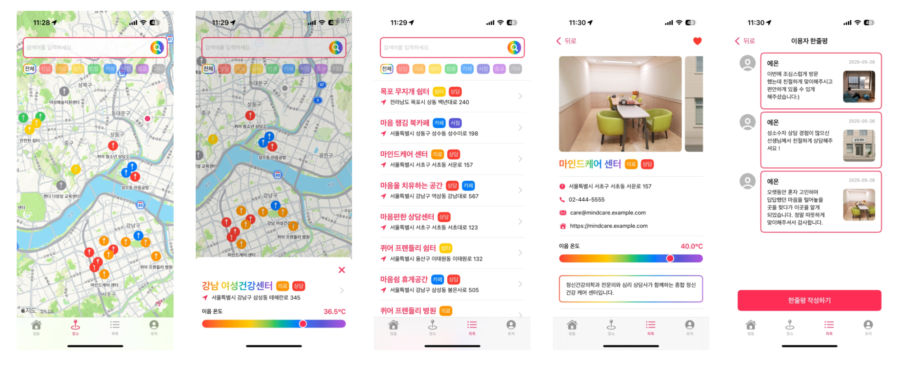
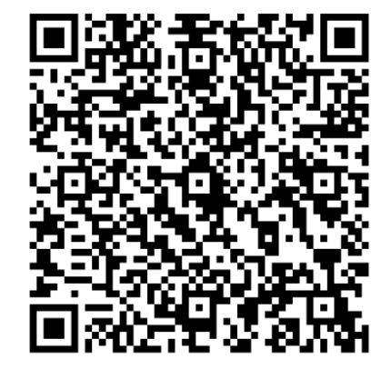
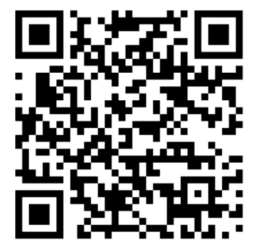

# 🌈 프로젝트 이음 (Project IEUM)

**성소수자 청소년을 위한 안전한 일상 지도**

---

## 🎯 개요

> **프로젝트 이음**은 성소수자 청소년들이 안전하고 차별 없이 지원을 받을 수 있는 **queer-friendly 장소 정보를 제공하는 모바일 지도 플랫폼**입니다.

### ✨ 핵심 가치

| 🗺️ | 🔒 | 🤝 |
|:---:|:---:|:---:|
| **지도 기반 서비스** | **안전성 보장** | **지역사회 연결** |
| 성소수자 친화적 장소 정보 | 인증 기반 정보 제공 | 지지 네트워크 구축 |

---

### 🎯 해결하고자 하는 문제들

<strong>📍 접근성 문제</strong>

- 언제, 어디서든 접근 가능한 성소수자 친화적 상담기관 정보 부족
- 비성소수자들의 이해와 지지 방법 부족
- 서울 외 지역의 지원 서비스 부족

<strong>🛡️ 안전성 문제</strong>

- 차별과 혐오로부터 안전한 공간 부족
- 정체성 노출에 대한 우려
- 신뢰할 수 있는 정보원 부족

---

## 🚀 주요 기능

### 📱 핵심 기능

<table>
<tr>
<td width="33%" align="center">

### 🗺️ **지도 서비스**
- 실시간 장소 표시
- 카테고리별 필터링
- 상세 정보 제공

</td>
<td width="33%" align="center">

### 🔐 **인증 시스템**
- QR 코드 기반 인증
- 단계별 정보 공개
- 협력기관 연동

</td>
<td width="33%" align="center">

### 💬 **커뮤니티**
- 장소 리뷰 및 평가
- 새로운 장소 제보
- 안전 정보 공유

</td>
</tr>
</table>

### 📊 화면 구성

---

## 🛠️ 설치 방법

### 📱 모바일 앱

|             iOS             |               Android               |
|:---------------------------:|:-----------------------------------:|
|  |  |

---

